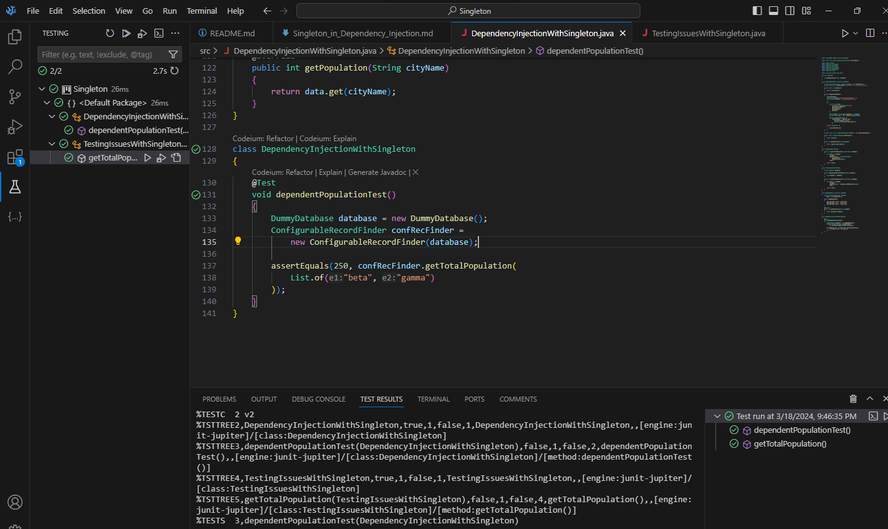

# Singleton in Dependency Injection

In this lesson we're going to see how can we fix the problem detected on the previous one of actually not being able to even get a unit test and getting an integration test whenever we actually interacted with the database. 

As you may already suspect, the problem lays on this line of code:

```java
(city -> SingletonDatabase.getInstance().getPopulation(city))
```

The problem here is that when you have a **SingletonRecordFinder** you actually have a hard dependency upon a concrete kind of database which is not good at all. You should remember the dependency inversion principle states that you should depend on the abstractions and in this case this certainly doesn't look like an abstraction, it's looking more like a concrete class.

So we're going to use dependency injection, and when we talk about dependency injection you're probably thinking about heavy frameworks like Spring, or Google Guice, or something to that effect. But in a factual matter dependency injection is just this idea of providing a dependency so insteade of using a framework we're going to inject the dependency ourselves.

Here we're just going to see how to enforce the dependency on inversion principle in this particular case so as to depend on an abstraction instead of a concrete singleton.

To do that we first write a new class called `ConfigurableRecordFinder` which implementation is going to be similar to the `SingletonRecordFinder` except that we're going to have the database as a dependency by introducing some abstraction on it:

```java

interface Database
{
    int getPopulation(String cityName);
}

class SingletonDatabase implements Database
{
    //...
}

class ConfigurableRecordFinder
{
    private Database database;

    public ConfigurableRecordFinder(Database database)
    {
        this.database = database;
    }

    public int getTotalPopulation(List<String> cityNames)
    {
        int result = cityNames
            .stream()
            .mapToInt(city -> database.getPopulation(city))
            .sum();

        return result;
    }
}
```

So we've now fixed the `RecordFinder` to actually allow yourself to provide some sort of database, which is a dummy database and that's exactly what we're going to construct because remember, we want a **unit test**. That's why we want the database part of the that unit test to be a completely dummy part with dummy data that is predictable that doesn't require you to really access the database, doesn't require you previous knowledge of anything concerning to the database, and in that way even if the values change on the actual database our unit tests remains intact.

Now is time to code some dummy database:

```java
class DummyDatabase implements Database
{
    private Dictionary<String, Integer>
        data = new Hashtable<>();

    public DummyDatabase()
    {
        data.put("alpha", 110);
        data.put("beta", 120);
        data.put("gamma", 130);
    }

    @Override
    public int getPopulation(String cityName)
    {
        return data.get(cityName);
    }
}
```

Now let's write a proper unit test:

```java
@Test
void dependentPopulationTest()
{
    DummyDatabase database = new DummyDatabase();
    ConfigurableRecordFinder confRecFinder = 
        new ConfigurableRecordFinder(database);

    assertEquals(250, confRecFinder.getTotalPopulation(
        List.of("beta", "gamma")
    ));
}
```

And if we run the test the output should be something similar to this:



The takeaway from this lesson is that the singleton isn't really a scary design pattern. All you have to do is to control your dependencies on the singleton and be able to actually plug-in different values, this means as long as you are able to substitute the singleton with some other implementation of that interface that singleton also implements, you're just fine. There is absolutely no problem in terms of testability but you have to plan in advance which is why we have these commercial grade dependency injection frameworks, because they help you figure out in advance all the dependencies and they make sure that if you want to substitute one of these dependencies you do have an ability to do so.
 