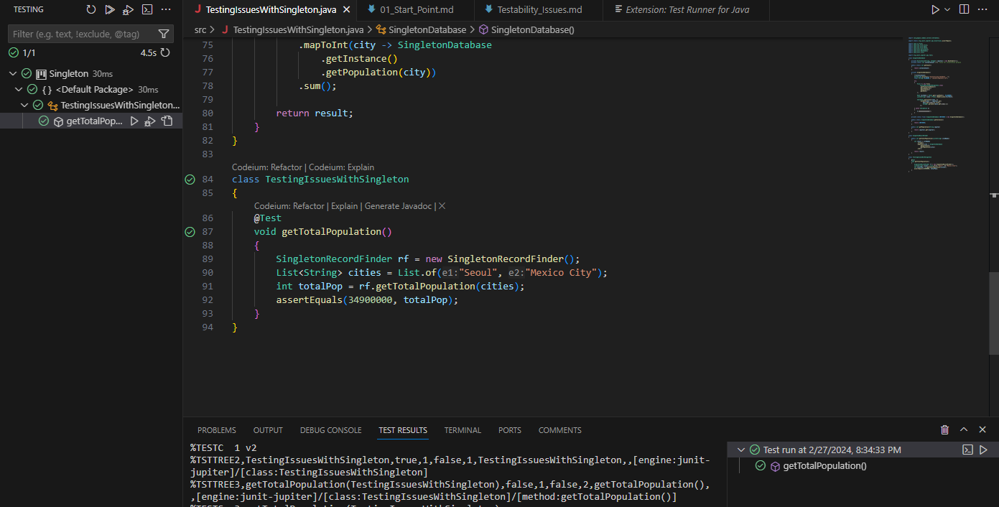

# Testability Issues

In this chapter we're going to take a look at some of the problems that arise as you use the singleton in real life development. We'll work on the `Capitals.txt` file, there are a few capitals and such as their estimate population, we're going to use it to simulate a database so we're going to load it into memory.

It just doesn't make sense to load this data into memory more than once, and that's precisely the reason you might want to make a Singleton in the first place.

## Requirements

* JDK 11 or higher
* VS Code or VSCodium
* Test Runner for Java extension
* Guava jar file
* JUnit Platform Console Standalone jar file

## Hands-on

Let's start coding our `SingletonDatabase` class responsable for loading the file into memory and making sure that there is only one instance of a `SingletonDatabase` at any point in time.

```java
class SingletonDatabase
{
    private Dictionary<String, Integer> capitals = new Hashtable<>();
    private static int instanceCount = 0; //only for illustration purpose

    public static int getCount()
    {
        return instanceCount;
    }

    private SingletonDatabase()
    {
        ++instanceCount;
        System.out.println("Initializing database...");
        final String FILENAME = "Capitals.txt";

        try 
        {
            File f = new File(
                SingletonDatabase.class
                .getProtectionDomain()
                .getCodeSource()
                .getLocation()
                .getPath()
            );

            Path fullPath = Paths.get(f.getPath(), FILENAME);
            List<String> lines = Files.readAllLines(fullPath);

            Iterables.partition(lines, 2)
                .forEach(data -> capitals.put(
                    data.get(0).trim(),
                    Integer.parseInt(data.get(1))
                ));

        } catch (Exception e)
        {
            e.printStackTrace();
        }
    }

    private static final SingletonDatabase INSTANCE = new SingletonDatabase();

    public static SingletonDatabase getInstance()
    {
        return INSTANCE;
    }
}
```

In simple terms, what we're basically doing here is defining a dictionary to emulate the table of our database and populating it just when we load our Singleton. We populate it in such a way that our `Capitals.txt` file must be in the same path level of our code, then finally we partionate all the content of that file in groups of two Strings because as you should remember each line describes the name of the capital followed by their estimate total population.

But could there be some dysfunctional behavior in this Singleton? Let's say you're asked to add a utility method for returning the population of a particular city.

```java
//...
public int getPopulation(String capital)
{
    return capitals.get(capital);
}
```

So far so good, right? Now, you're asked to perform some research on the different capitals and make a  match in such a way that will provide the total population of several different cities.

```java
//Different concern, different class
class SingletonRecordFinder
{
    public int getTotalPopulation(List<String> cityNames)
    {
        int result = names
            .stream()
            .mapToInt(city -> SingletonDatabase
                .getInstance()
                .getPopulation(city))
            .sum();

        return result;
    }
}
```

At first sight it seems all cool, but when we make a step futher and decide to cover `getTotalPopulation()` with tests we realize that, in the way it is, the only way to test the functionality is loading live data from the source.

```java
class SingletonTests
{
    @Test
    void getTotalPopulation()
    {
        SingletonRecordFinder rf = new SingletonRecordFinder();
        List<String> cities = List.of("Seoul", "Mexico City");
        int totalPop = rf.getTotalPopulation(cities);
        assertEquals(3490000, totalPop);
    }
}
```

As we can see, the test passes, so what is the problem with it? Well the problem is that, at the moment we don't want to be testing against live database, that just doesn't make sense now. What matter to us is to get some dummy data, stick that dummy data into our `SingletonRecordFinder` and procede the tests with that. At this moment that isn't a unit test is a integration test, it's testing both the behaviour of the `getTotalPopulation()` method as well as the behaviour of the database. And that's why we might want to isolate the database from this test and make it a proper unit test which tests just singleton and nothing else.

Check it out...


