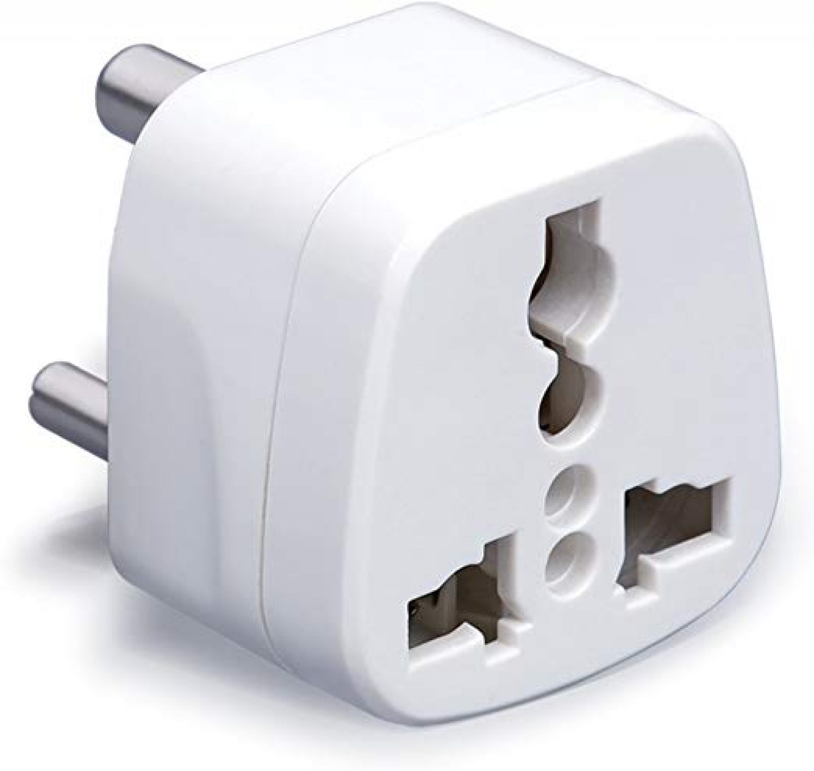

# Adapter

Now that we're ready to move on structural design patterns let's first see the _Adapter_ which concept is very simple. Is all about getting the interface that you want from the interface that you were given by some system or other.

So the typical representation of an _Adapter_ is just the same as you have in power adaptors.

So you know that eletrical devices in the real world have different power requirements and you can speak of these requirements as **interface requirements**. Let's say, voltage, plug type, all of these may vary from place to place and we cannot take the gadgets that we have with us just modify them to support every possible interface and indeed the manufacturers of eletrical devices do not give you an adapter for every country out there, so is up to you to buy one.

We need a special device which is called an adapter to give us the interface that we require from the interface that we have. The _Adapter_ pattern consists in a software, which typically can be a class or an interface, which adapts an existing interface _X_ to conform to the required interface _Y_.

In short terms, let's say that you are getting interface `B` from some system but some other system requires interface `A`. What you have to do is sort of connect one to the other and you write an extra piece of code to make that possible.
