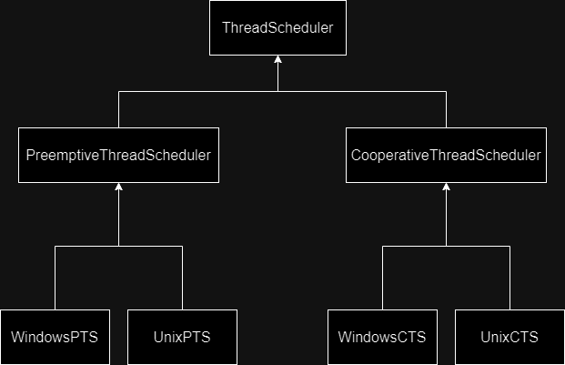
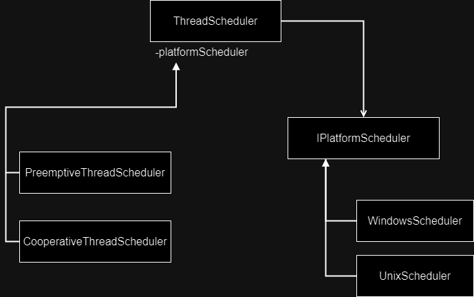

# Bridge

> Connecting components together through abstractions.

The bridge design pattern is all about connecting components together through abstractions. The motivation for building a bridge is to prevent what is called a *Cartesian Product* complexity explosion.

Let's suppose there is some base class called `ThreadScheduler` ok? It can be preemptive or cooperative, and it can also run on Windows or Unix. You may end up with a 2x2 scenario if you decide to implement four classes: `WindowsPTS`, `UnixPTS`, `WindowsCTS`, `UnixCST`.

The bridge pattern is precisely the thing that actually avoids this whole entity explosion. So instead of having something like this, where you have four distinct classes:

What might suit best is to depend on some sort of platform scheduler where there is some interface or something which is implemented by either Unix or Windows, and you also inherit from either `CST` or `PTS`. So you don't rely on inheritance as much as an inheritance plus aggregation:

Essentially a bridge is a mechanism that decouples an interface from its implementation. Both of these can be hierarchy's, but they don't have to engage in one big inheritance relationship. So you can have inheritance and aggregation in the same class, keeping references to other components.

## Summary

The idea of the bridge is to decouple the abstraction from the implementation, both of these can exist as hierarchies if you want them to. Essentially you can think of a bridge as a stronger form of encapsulation.
